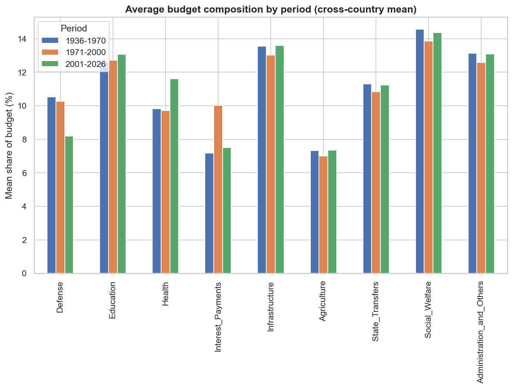
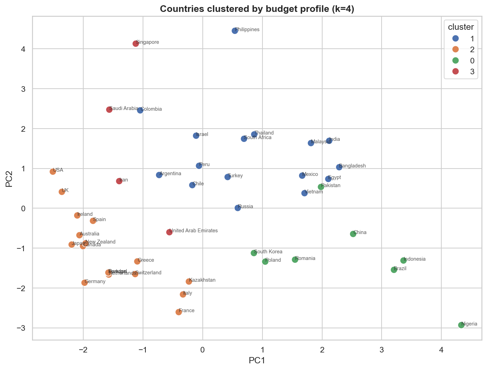
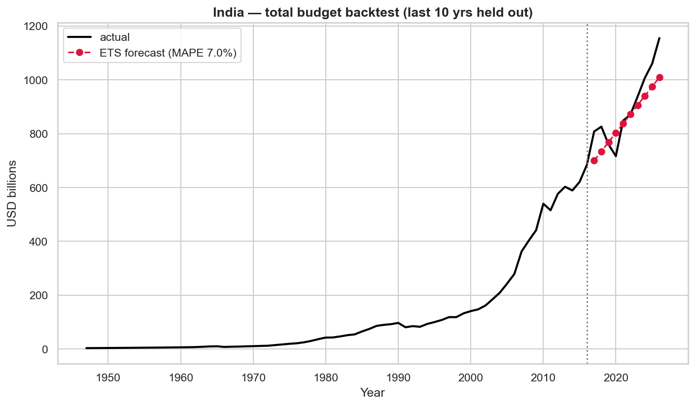
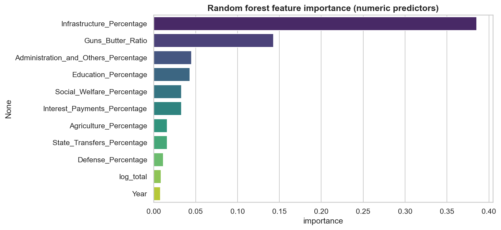

# Global Government Budgets — Analysis Project

[](https://github.com/shrutidc/Global-Budget-Allocation/actions/workflows/ci.yml)

A reproducible data-science project on **45 countries' government budgets, 1936–2026**, covering
9 spending categories (in both percentage-of-budget and USD terms). It's built to support a wide
range of use cases from a single clean pipeline: **EDA, data visualization, cross-country
comparison, time-series forecasting, machine learning, and public-finance / policy analysis.**

> Amounts are **nominal USD billions** (not inflation-adjusted). Each category value is that
> function's *share* of the country-year's total budget; the nine shares sum to 100.

## Objectives & goals

- Turn 45 countries' raw budget history into **one clean, validated analytical panel** that many downstream analyses can share.
- Demonstrate an **end-to-end, reproducible data-science workflow** — ingestion → validation → feature engineering → EDA → modeling → forecasting → written findings.
- Answer concrete public-finance questions: who spends the most, where the money goes, how spending priorities shift across eras, and whether spending trajectories are forecastable.
- Ship the analysis as **reusable, tested software** (a package + CI) rather than one-off notebook cells.

## Highlights

- Clean panel: 3,654 country-year rows, **zero missing values**, shares validated to sum to 100.
- Reusable `globalbudget` package (loading, validation, features, viz, forecasting).
- Six executed notebooks telling a complete analytical story.
- Deterministic pipeline (`scripts/build_processed_data.py`) producing tidy datasets.
- See **[`reports/findings.md`](reports/findings.md)** for the write-up of key results.

## Repository layout

```
.
├── data/
│   ├── raw/                      # Original CSVs (master + 45 individual country files)
│   └── processed/                # Generated tidy datasets (wide, long, profiles)
├── src/globalbudget/             # Reusable analysis package
│   ├── data_loader.py            # load master / country / processed tables
│   ├── cleaning.py               # integrity validation + wide→long reshape
│   ├── features.py               # growth, rolling, guns-vs-butter, eras, ML frame
│   ├── viz.py                    # themed plot helpers + category palette
│   └── forecasting.py            # naïve/drift/ETS/ARIMA + backtesting
├── notebooks/
│   ├── 01_eda.ipynb                      # structure, integrity, distributions
│   ├── 02_visualization.ipynb            # trends, stacked-area composition, heatmaps
│   ├── 03_cross_country.ipynb            # rankings + KMeans clustering + PCA
│   ├── 04_time_series_forecasting.ipynb  # per-country forecasts + backtests
│   ├── 05_machine_learning.ipynb         # supervised model + feature importance
│   └── 06_economic_policy_analysis.ipynb # guns-vs-butter, interest burden, eras
├── reports/
│   ├── figures/                  # exported PNGs (regenerated by the notebooks)
│   └── findings.md               # consolidated write-up
├── scripts/build_processed_data.py
├── requirements.txt
└── LICENSE
```

## Data dictionary

Each row is one **country-year**. Columns in the raw master table:

| Column | Description |
|--------|-------------|
| `Country` | Country name |
| `Year` | Calendar year (1936–2026) |
| `Total_Budget_Billions_USD` | Total government budget, nominal USD billions |
| `<Category>_Percentage` | Category's share of the total budget (%) |
| `<Category>_Amount_Billions_USD` | Category spend, nominal USD billions |

The nine **categories** are: `Defense`, `Education`, `Health`, `Interest_Payments`,
`Infrastructure`, `Agriculture`, `State_Transfers`, `Social_Welfare`,
`Administration_and_Others`.

Processed artifacts in `data/processed/`:

- `budgets_wide.{parquet,csv}` — validated master + engineered features (growth, rolling mean,
  guns-vs-butter ratio, era).
- `budgets_long.{parquet,csv}` — tidy long format: one row per `Country × Year × Category`.
- `country_profiles.csv` — mean spending profile per country.
- `validation_report.json` — integrity-check output.

## Getting started

```bash
# 1. (recommended) create a virtual environment
python3 -m venv .venv && source .venv/bin/activate

# 2. install dependencies
pip install -r requirements.txt

# 3. build the processed datasets
python scripts/build_processed_data.py

# 4. explore the notebooks
jupyter lab            # open anything in notebooks/
```

Use the package directly:

```python
import sys; sys.path.insert(0, "src")
from globalbudget import data_loader, cleaning, features, forecasting

wide = data_loader.load_master()
cleaning.validate(wide)                       # integrity report
long = cleaning.to_long(wide)                 # tidy format
s = forecasting.country_series(wide, "USA", "Total_Budget_Billions_USD")
forecasting.compare_models(s, test_size=10)   # backtest naïve/drift/ETS/ARIMA
```

## Reproducing the analysis

Notebooks are committed with outputs. To re-run everything from scratch:

```bash
python scripts/build_processed_data.py
jupyter nbconvert --to notebook --execute --inplace notebooks/*.ipynb
```

## Tests

The `globalbudget` package is covered by a `pytest` suite (`tests/`) that checks data integrity,
the wide→long reshape, feature engineering, and the forecasting/backtesting logic:

```bash
python -m pytest          # 26 tests
```

## Methodology

1. **Ingestion** (`data_loader.py`) — load the master table + 45 per-country CSVs.
2. **Validation** (`cleaning.py`) — assert 3,654 country-year rows, zero missing values, no duplicate country-years, and that the nine category shares sum to 100 (±0.03); emit `validation_report.json`.
3. **Reshape** — pivot the validated wide table into tidy long format (one row per `Country × Year × Category`).
4. **Feature engineering** (`features.py`) — year-over-year growth, rolling means, a guns-vs-butter ratio (Defense ÷ Social), spending-era buckets, and an ML feature frame.
5. **Analysis** (notebooks 01–06) — EDA, visual composition, cross-country clustering (KMeans) + PCA, per-country forecasting, supervised ML, and economic-policy analysis.
6. **Forecasting** (`forecasting.py`) — naïve / drift / ETS / ARIMA with walk-forward backtesting scored on held-out years.

## Results & key findings

Full write-up in **[`reports/findings.md`](reports/findings.md)**. Headlines:

- **Concentration:** global public spending is heavily right-skewed — the USA (~$13.1T) and China (~$6.7T) dwarf the rest; the top 5 economies dominate.
- **Priorities shift by era:** guns-vs-butter ratios fall across the post-war decades as social welfare and health claim a growing share of budgets.
- **Forecastability:** total-budget series are smooth enough that ETS/ARIMA beat naïve baselines on most countries in walk-forward backtests, but interest-payment shares are the hardest to predict.
- **Structure:** KMeans + PCA separate countries into interpretable spending archetypes (defense-heavy, welfare-heavy, development-heavy).

## Visualizations

Regenerated by the notebooks into `reports/figures/`. A few examples:

| Spending composition over time | Cross-country clusters (PCA) |
|---|---|
|  |  |

| Forecast backtest (India) | ML feature importance |
|---|---|
|  |  |

## Potential next steps

- **Inflation-adjust** amounts (currently nominal USD) to make multi-decade dollar trends comparable in real terms.
- Add **per-capita and %-of-GDP** normalizations for fairer cross-country comparison.
- Extend forecasting with **hierarchical / global models** (e.g. a single model across countries) and prediction intervals.
- Publish the cleaned panel as a versioned dataset and wire the notebooks into the CI so figures never drift from data.

## Individual contributions

Sole author. I designed and built the entire pipeline end to end: the `globalbudget` package (loading, validation, feature engineering, visualization, forecasting), all six analysis notebooks, the deterministic build script, the 26-test `pytest` suite, the GitHub Actions CI workflow, and the consolidated findings write-up.

## Use cases this project supports

Machine learning · time-series forecasting · public-finance research · government-spending
analysis · economic modeling · cross-country comparison · policy research · academic projects ·
data visualization · exploratory data analysis.

## License

[MIT](LICENSE). The dataset is included under `data/raw/` for reproducibility.
